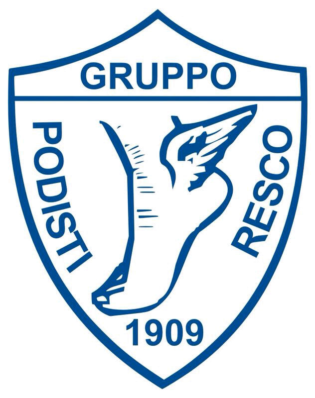

[Gruppo Podisti Resco 1909](http://www.podistiresco.it/)
# Accesso alla pista di atletica dello stadio di Cascia Reggello

    Aggiornata al 28/02/2024

## Requisiti

 - Portare con se copia del certificato medico valido da esibire ad eventuale richiesta
 - Accesso consentito dal lunedì alla domenica, dalle 8.00 alle 18.00, dall'ingresso principale.
	 - **Escluso** quando ci sono le partite
	 - L'orario di chiusura segue la presenza di luce, probabilmente in estate sarà esteso.
 - Non è possibile usufruire degli spogliatoi

## Modifiche previste per il futuro

 - Possibilità di accedere con un badge, previo rilascio del certificato medico
 - Costruzione di nuovi spogliatoi per chi farà la pista

